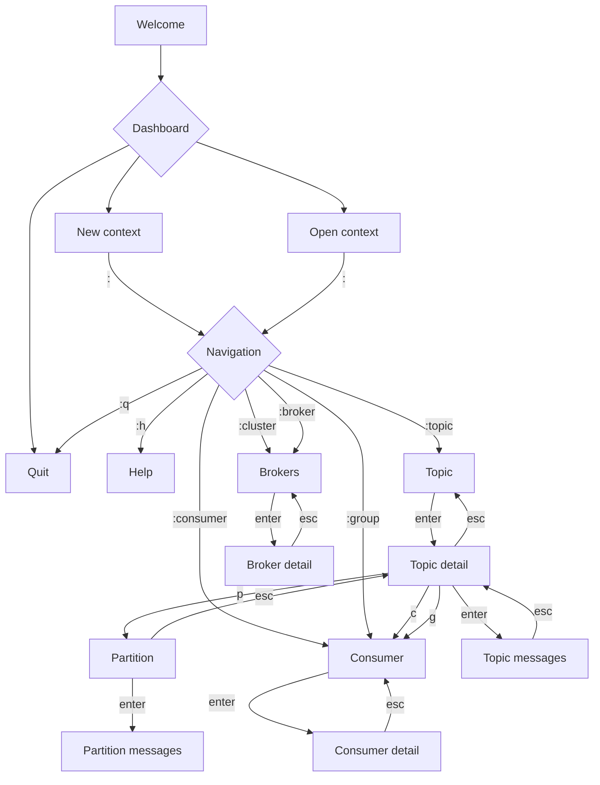

# kafkalypse

Kafka TUI

```mermaid

flowchart TD
    SPLASH[Welcome] --> MAIN{Dashboard}
    MAIN --> NEW_CONTEXT[New context]
    MAIN --> OPEN_CONTEXT[Open context]
    MAIN --> QUIT[Quit]
    NEW_CONTEXT --> |:| NAV{Navigation}
    OPEN_CONTEXT --> |:| NAV{Navigation}
    NAV --> |:q| QUIT[Quit]
    NAV --> |:h| HELP[Help]
    NAV --> |:topic| TOPIC[Topic]
    NAV --> |:consumer| CONSUMER[Consumer]
    NAV --> |:group| CONSUMER
    NAV --> |:cluster| BROKERS[Brokers]
    NAV --> |:broker| BROKERS

    TOPIC --> |enter| TOPIC_DETAIL[Topic detail]
    TOPIC_DETAIL --> |esc| TOPIC
    TOPIC_DETAIL --> |p| PARTITION[Partition]
    TOPIC_DETAIL --> |c| CONSUMER[Consumer]
    TOPIC_DETAIL --> |g| CONSUMER
    TOPIC_DETAIL --> |enter| TOPIC_MESSAGE[Topic messages]

    PARTITION --> |esc| TOPIC_DETAIL
    PARTITION --> |enter| PARTITION_MESSAGE[Partition messages]

    CONSUMER --> |enter| CONSUMER_DETAIL[Consumer detail]
    CONSUMER_DETAIL --> |esc| CONSUMER

    BROKERS --> |enter| BROKER_DETAIL[Broker detail]
    BROKER_DETAIL --> |esc| BROKERS

    TOPIC_MESSAGE --> |esc| TOPIC_DETAIL
```
