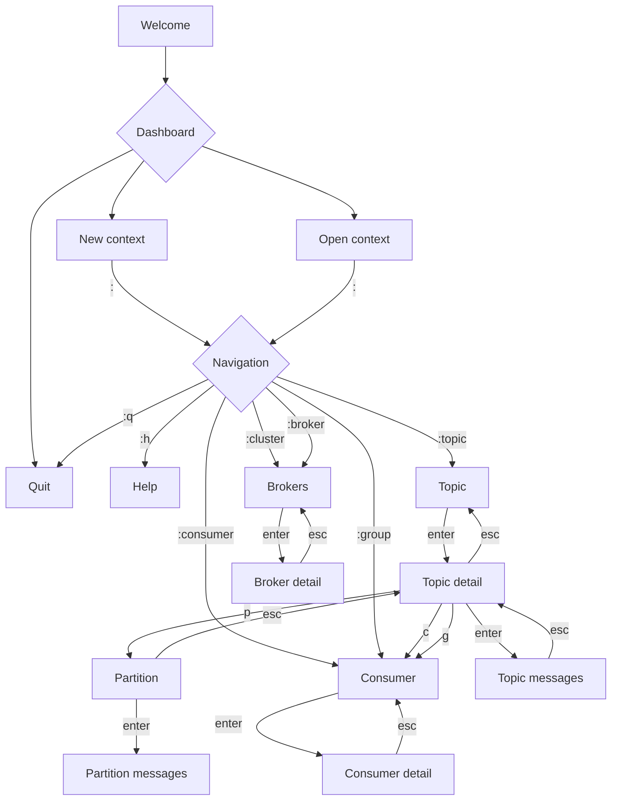

# Kafkalypse

A modern, terminal-based Kafka management interface built in Go. Kafkalypse provides an intuitive way to manage Apache Kafka clusters directly from your terminal.


## Features

- 🚀 Modern terminal user interface using [Bubble Tea](https://github.com/charmbracelet/bubbletea)
- 🎨 Beautiful UI with [Catppuccin](https://github.com/catppuccin/catppuccin) color scheme
- 📊 Topic management:
  - View topic list with partitions and replica information
  - Create new topics
  - Delete topics
  - View topic details and configurations
- 👥 Consumer group management
- 🔄 Real-time updates and monitoring
- 🌐 Multi-cluster support through contexts
- ⌨️ Keyboard-driven navigation

## Installation

### From Source

```bash
go install github.com/snakeice/kafkalypse@latest
```

### Prerequisites

- Go 1.19 or later
- Access to a Kafka cluster

## Usage

1. Start Kafkalypse:

   ```bash
   kafkalypse
   ```

2. Create a new context:

   - Press `n` to create a new context
   - Enter your Kafka cluster details

3. Navigate the interface:
   - Use arrow keys for navigation
   - Press `?` to view available shortcuts
   - Press `q` to go back/quit

### Keyboard Shortcuts

- `n`: Create new topic/context
- `d`: Delete topic
- `r`: Refresh
- `enter`: View details
- `q`: Go back/quit
- Arrow keys: Navigate

## Configuration

Kafkalypse stores its configuration in `~/.config/kafkalypse/config.yaml`. You can define multiple Kafka cluster contexts in this file:

```yaml
contexts:
  - name: local
    bootstrap_servers: localhost:9093
  - name: production
    bootstrap_servers: kafka1:9093,kafka2:9093,kafka3:9093
current_context: local
```

## Development

### Requirements

- Go 1.19+
- [pre-commit](https://pre-commit.com/)

### Setup

1. Clone the repository:

   ```bash
   git clone https://github.com/snakeice/kafkalypse.git
   cd kafkalypse
   ```

2. Install dependencies:

   ```bash
   go mod download
   ```

3. Install pre-commit hooks:

   ```bash
   pre-commit install
   ```

4. Run the application:
   ```bash
   go run main.go
   ```

### Contributing

1. Fork the repository
2. Create your feature branch (`git checkout -b feature/amazing-feature`)
3. Commit your changes (`git commit -m 'Add some amazing feature'`)
4. Push to the branch (`git push origin feature/amazing-feature`)
5. Open a Pull Request

## License

This project is licensed under the MIT License - see the [LICENSE](LICENSE) file for details.

## Acknowledgments

- [Bubble Tea](https://github.com/charmbracelet/bubbletea) for the TUI framework
- [Sarama](https://github.com/IBM/sarama) for the Kafka client
- [Catppuccin](https://github.com/catppuccin/catppuccin) for the color scheme


